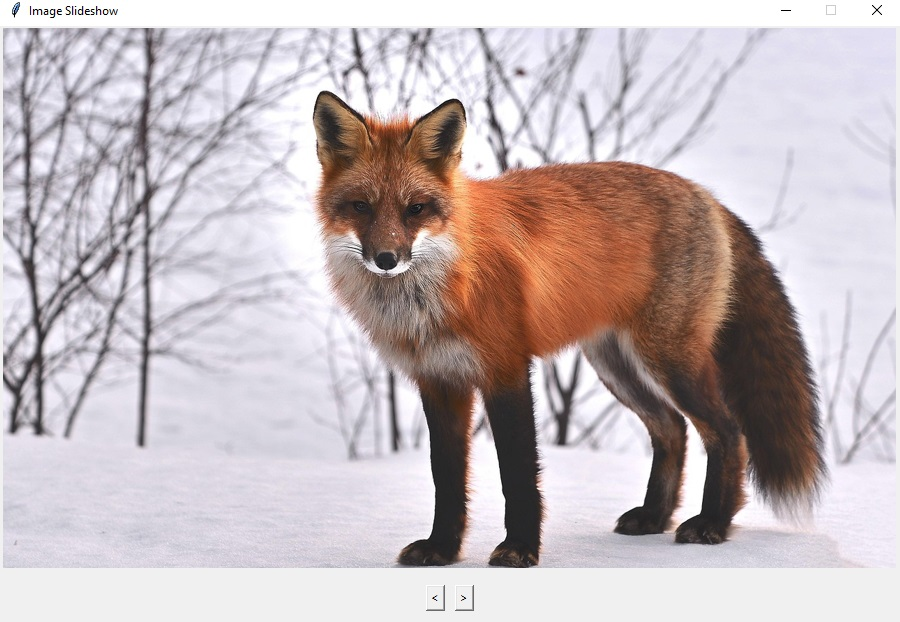

# Python Tkinter Image Slideshow

A simple desktop image slideshow application built in Python with Tkinter and Pillow.  
Cycle through images in your `assets/` folder with Previous/Next buttons—resize and center logic ensures each image fits perfectly.

---

## 📝 Features

- **Previous / Next Navigation**  
  Click “<” or “>” buttons to move through your image collection.  
- **Auto-Resize & Centering**  
  Images larger than the window are thumbnail-scaled; all images are centered in the canvas.  
- **Error Handling**  
  Shows an alert and exits if no images are found in `assets/`.

---

## 🛠️ Technologies

- **Python 3.x**  
- **Tkinter** (built-in) for the GUI  
- **Pillow** for image loading and resizing  

---

## 🚀 Getting Started

 **Clone this repository**  
   ```
   bash
   git clone https://github.com/DamianosMav/image_slideshow.git
   cd tkinter-todo
   ```

 **Install dependencies**
    pip install -r requirements.txt

 **Populate your assets folder**
    Add your image files (.jpg, .png, etc.) into the assets/ folder.

## Run the app
    python main.py

## ⚙️Configuration
    Window size
    Edit width and height defaults in SlideshowApp.__init__ if you want a different canvas size.

    Asset directory
    By default, uses the assets/subfolder. Change assets_path = Path(__file__).parent / "assets" in main.py to point elsewhere if needed.

## 📸 Screenshots


## 📄License
This project is licensed under the MIT License. See [LICENSE](LICENSE) for details.

Built by Damianos Mav
Feel free to ⭐ the repo if you find it useful.